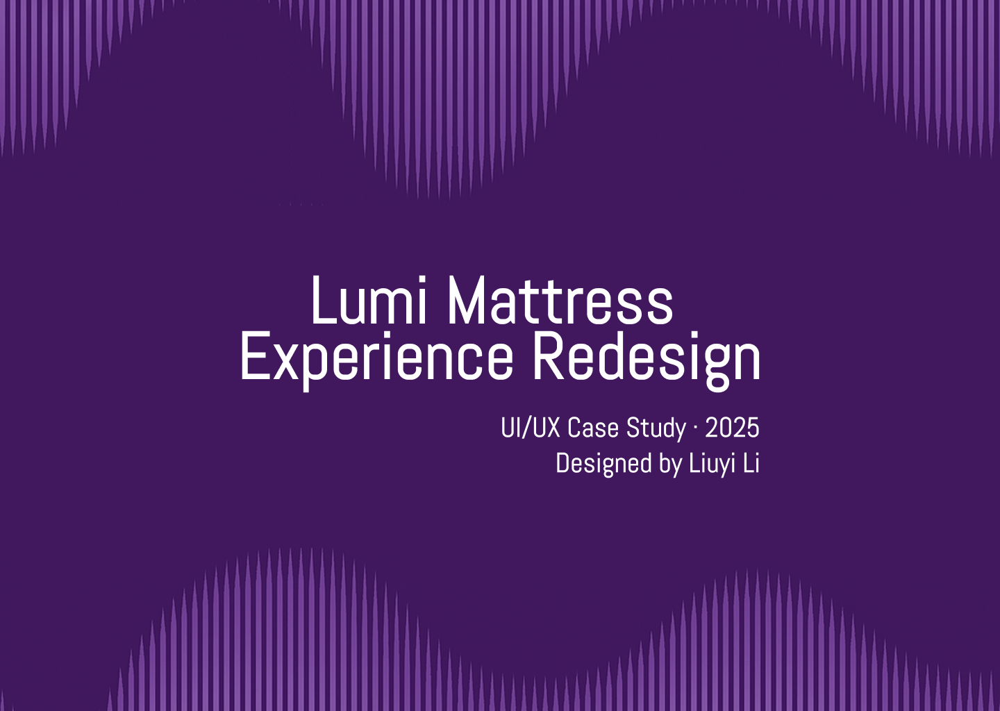
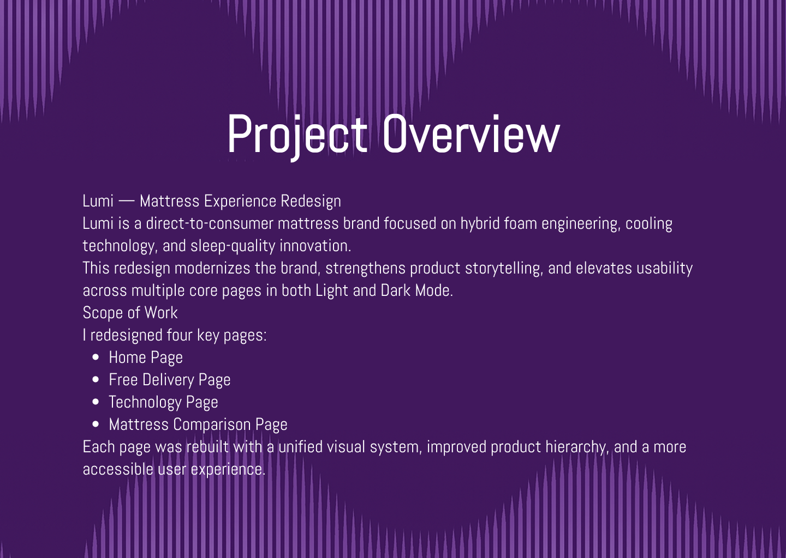
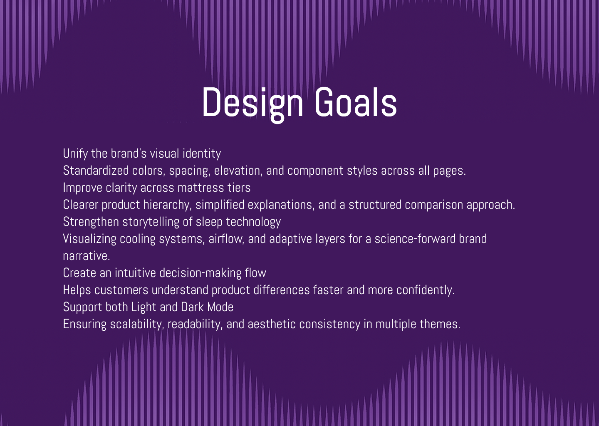
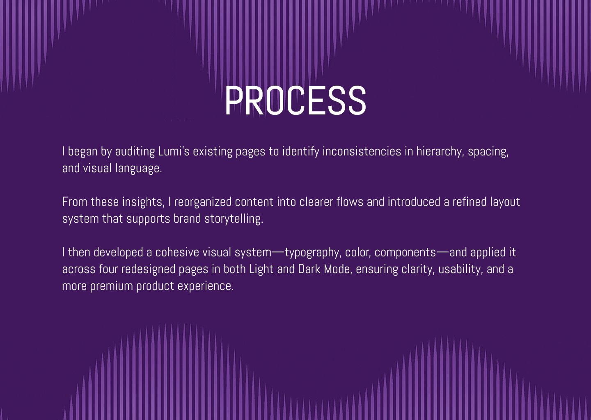
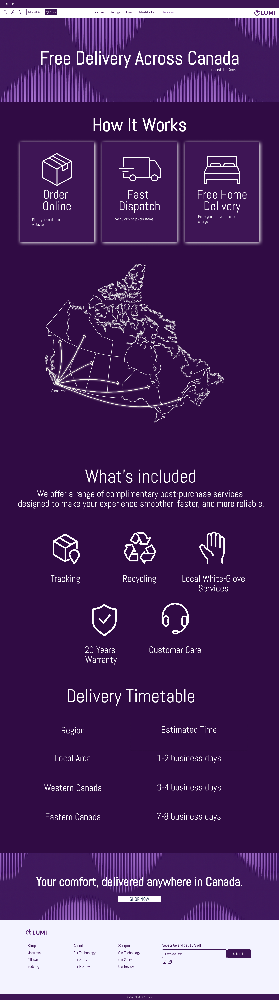
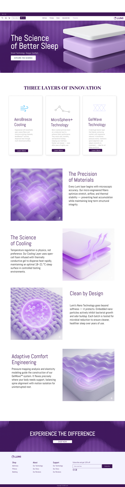

# lumi-brand-system
A self-initiated UI/UX design project exploring a soft-tech purple identity, high-fidelity layouts, and brand storytelling.
# Lumi — Mattress Experience Redesign  
*A self-initiated UI/UX design project by Liuyi Li (2025)*

Lumi is a conceptual, direct-to-consumer mattress brand exploring hybrid foam engineering,  
cooling technology, and a science-forward visual identity.

This project redesigns four core product experience pages with a unified brand system,  
improved usability, and a modern soft-tech purple aesthetic across both Light and Dark Mode.

---

## ⭐ Project Overview  
The goal of this redesign was to modernize Lumi’s visual identity and create a more intuitive,  
story-driven product experience.

**Scope of Work:**

- Home Page  
- Free Delivery Page  
- Technology Page  
- Mattress Comparison Page  

Each page was rebuilt with a consistent layout, refined hierarchy, improved storytelling,  
and an accessible experience across multiple themes.

---

## 🧭 Design Goals  
- Establish a unified visual identity  
- Standardize spacing, typography, elevation, and components  
- Improve clarity across mattress tiers  
- Strengthen storytelling of cooling & comfort technologies  
- Visualize airflow, adaptive layers, and micro-materials  
- Create a clearer decision-making flow for customers  
- Support both Light Mode and Dark Mode  
- Ensure scalability, clarity, and premium brand polish  

---

## 🔧 Process  
The redesign began with an audit of Lumi’s existing pages to identify issues with spacing,  
hierarchy, and brand cohesion.

I reorganized content into clearer flows and introduced a modern layout system that supports  
technical storytelling. A cohesive visual system—typography, color palette, motion direction,  
and components—was applied across all four pages.

---

## 📸 Visual Showcase  
Below are the exported high-fidelity screens from the redesign:

### **01–04 · Project Introduction**

---

### **05–06 · Home Page**

---

### **07–08 · Free Delivery Page**

---

### **09–10 · Technology Page**

---

### **11–12 · Mattress Comparison Page**

---

## 🛠️ Tools  
- **Figma** — High-fidelity UI design  
- **Photoshop + Illustrator** — Asset refinement  
- **AI-assisted concept visuals** — Enhanced consistency  
- **GitHub** — Versioning and documentation  

---

## 📬 About the Designer  
Designed by **Liuyi Li**, a UI/UX & visual designer based in Vancouver.  
Focused on building clean, modern, and storytelling-driven digital experiences.

---

## ⭐ License  
This project is a **self-initiated conceptual redesign**.  
All visuals are original and may not represent any existing commercial brand.

